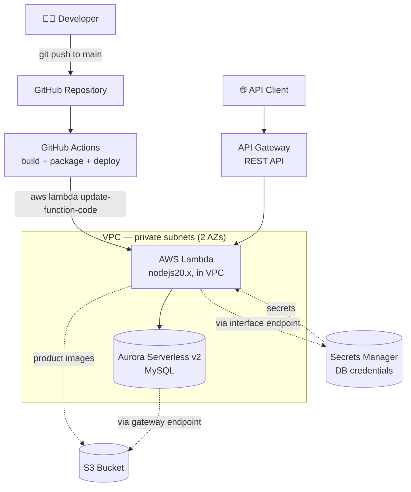

# AWS Fully Serverless Architecture with CI/CD


A fully serverless, Infrastructure-as-Code architecture on AWS: a Node.js/Express REST API running on Lambda, backed by Aurora Serverless v2 (MySQL), fronted by API Gateway, with secrets pulled from Secrets Manager — all provisioned with Terraform, and deployed continuously via GitHub Actions.

## Architecture



## Tech Stack & Pinned Versions

| Component             | Version            |
|------------------------|---------------------|
| Terraform               | 1.15.6              |
| AWS provider             | ~> 6.50.0            |
| Random provider          | ~> 3.9.0             |
| Lambda runtime           | nodejs20.x           |
| Database engine          | Aurora MySQL Serverless v2 |
| CI/CD                    | GitHub Actions       |

## Prerequisites

- AWS account with sufficient permissions to create VPC, RDS, Lambda, API Gateway, IAM, KMS, S3, Secrets Manager resources
- AWS CLI v2, Terraform 1.15+, Node.js 20.x installed on the build machine
- No custom domain required — this build uses the default API Gateway invoke URL (original design expects an existing Route53 hosted zone + ACM certificate; removed here since neither was available)

## Setup — Step by Step

### 1. Configure AWS CLI
```bash
aws configure --profile default
```

### 2. Adapt Terraform code (already applied in this repo)
- Removed `data "aws_acm_certificate"`, `aws_api_gateway_domain_name`, `data "aws_route53_zone"`, `aws_route53_record`, and `aws_api_gateway_base_path_mapping` (no domain available)
- Added explicit `aws_api_gateway_stage` resource (AWS provider v6 removed `stage_name` from `aws_api_gateway_deployment`)
- Removed hardcoded Aurora `engine_version` (let AWS pick the current default for `aurora-mysql`)
- Lambda runtime bumped from `nodejs16.x` (deprecated) to `nodejs20.x`

### 3. Package the Lambda function
```bash
cd serverless-api
npm install --omit=dev
zip -r ../artifact.zip . -x ".git*" -x ".gitignore"
cd ..
```

### 4. Deploy infrastructure
```bash
terraform init
terraform plan
terraform apply
```

### 5. Test
```bash
curl https://<api_invoke_url-output>/healthz
curl -X POST https://<api_invoke_url-output>/user \
  -H "Content-Type: application/json" \
  -d '{"username":"test@example.com","password":"Test@1234","first_name":"First","last_name":"Last"}'
```

### 6. Continuous deployment (GitHub Actions)
A dedicated IAM user (`github-actions-deploy`) scoped to only `lambda:UpdateFunctionCode` + `lambda:GetFunction` on this function is used for CI/CD — **not** the broad-permission Terraform user. Its access key/secret are stored as repository secrets (`AWS_ACCESS_KEY_ID`, `AWS_SECRET_ACCESS_KEY`, `LAMBDA_FUNCTION_NAME`). Any push to `main` touching `serverless-api/**` triggers `.github/workflows/deploy.yml`, which builds and redeploys the Lambda code automatically — infrastructure changes still go through manual `terraform apply`.

## Issues Faced & Fixes

| Issue | Root Cause | Fix |
|---|---|---|
| `terraform plan` error: `stage_name` unsupported on `aws_api_gateway_deployment` | AWS provider v6 removed this argument; stages must now be a separate resource | Added a standalone `aws_api_gateway_stage` resource, removed `stage_name` from the deployment resource |
| `terraform apply` failed creating RDS cluster: `Cannot find version 8.0.mysql_aurora.3.02.0` | Hardcoded Aurora engine version from the original 2023 project is no longer offered by AWS | Removed the `engine_version` line entirely; AWS now applies its current default |
| Lambda `Runtime.ImportModuleError: Cannot find module 'dotenv'` | Deployment zip was missing `node_modules` — Node.js wasn't installed on the build machine, so `npm install` never actually ran | Installed Node.js 20.x via NodeSource, ran `npm install --omit=dev`, repackaged the zip |
| `apt-get install nodejs` failed: unmet dependencies (`ruby2.x`/`ruby3.x` unsatisfiable) | A previous project's forced install (`dpkg -i --force-depends`) of `codedeploy-agent` left a broken dependency record blocking unrelated package installs | `apt-get remove --purge codedeploy-agent` + `apt --fix-broken install` before retrying |
| First `POST /user` request returned `502` | Cold-start: Lambda's VPC network interface + DB connection took longer than the request timeout | Normal serverless cold-start behavior — retried and the request succeeded with a `201 Created` |

## Cleanup (avoid ongoing AWS charges)

This architecture is **not** free-tier — Aurora Serverless v2, the KMS key, and the Secrets Manager VPC interface endpoint all accrue small hourly charges while running.

```bash
terraform destroy
```

Also remove the two dedicated IAM users created for this project once you're done:
- `terraform-deploy` (broad permissions, used for `terraform apply`)
- `github-actions-deploy` (scoped, used by the CI/CD workflow)

And delete the repository secrets (`AWS_ACCESS_KEY_ID`, `AWS_SECRET_ACCESS_KEY`, `LAMBDA_FUNCTION_NAME`) if the repo will stay public long-term.

## Credits

Architecture and application source adapted from [NotHarshhaa/DevOps-Projects — Project 22](https://github.com/NotHarshhaa/DevOps-Projects/tree/master/DevOps-Project-22). AWS infrastructure adaptation, fixes, and GitHub Actions CI/CD implemented end-to-end by Hafiz Muhammad Umar Rafique.
